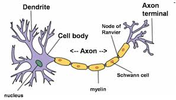

# Artificial-neural-network
Artificial Neural Networks (ANN) is a supervised learning system built of a 
large number of simple elements, called neurons or perceptrons. Each neuron 
can make simple decisions, and feeds those decisions to other neurons, organized
in interconnected layers. Together, the neural network can emulate almost any 
function, and answer practically any question, given enough training samples
and computing power. 

   

 

A “shallow” neural network has only three layers of neurons: 
1. An input layer that accepts the independent variables or inputs of the model 
2. hidden layer 
3. An output layer that generates predictions  

   

